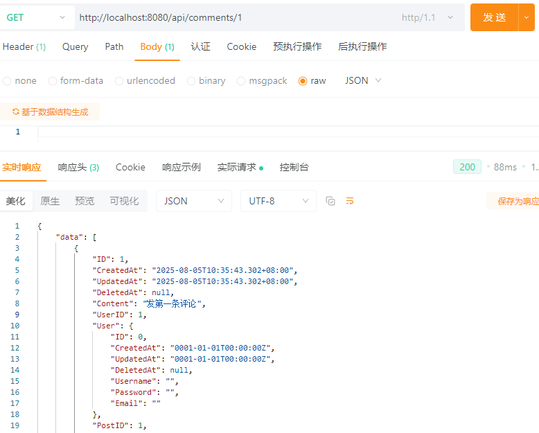

# Go Blog
# A simple blog written in Go
# Features
# 使用 Go 语言结合 Gin 框架和 GORM 库开发一个个人博客系统的后端，实现博客文章的基本管理功能，包括文章的创建、读取、更新和删除（CRUD）操作，同时支持用户认证和简单的评论功能。
# Steps:
# 1. 安装 Go 语言环境
# 2. 安装 Gin 框架和 GORM 库
# 2.1 安装 Gin 框架
# ```bash
go get -u github.com/gin-gonic/gin
# ```
# 2.2 安装 GORM 库
go get -u gorm.io/gorm
go get -u gorm.io/driver/mysql

# 3. 创建数据库并配置连接
# 4. 实现用户认证功能
# 5. 实现文章的 CRUD 操作
# 6. 实现评论功能
# 7. 错误处理与日志记录
# 8. 测试与部署
# 9. API 文档
## 9.1 Register


## 9.2 Login


## 9.3 Create Article

## 9.4 Get Article

## 9.5 Update Article

## 9.6 Delete Article

## 9.7 Create Comment

## 9.8 Get Comments
